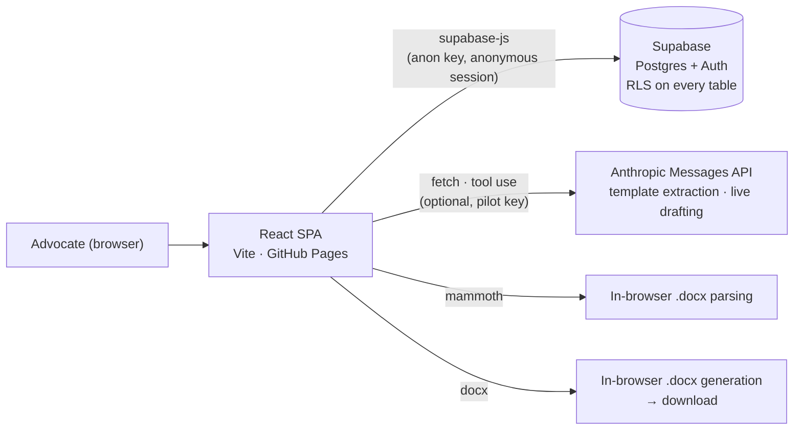

# Pattang

**The solo advocate's briefcase: cases, documents and drafts in one workspace.**

[Live app](https://chanman22git.github.io/Pattang/) · [Portfolio](https://chanman22git.github.io/builtbyinstincts/)

## Executive summary

- **Problem:** a solo advocate in India juggles dozens of matters, each with its
  own parties, facts, deadlines and near-identical documents that are usually
  rebuilt by copy-pasting old Word files.
- **What it does:** Pattang is a web workspace that keeps each case and its
  documents together and generates recurring legal documents (petitions, appeals,
  notices) from reusable templates. It can learn a template from a sample
  document and draft a document with AI, then export it as a Word (`.docx`) file.
- **Who it's for:** individual advocates practising in India. v1 targets a single
  advocate, and the data model is already multi-user (every row is owned by a
  user and protected by row-level security).
- **Status:** early pilot / in development. Cases, templates and document
  generation work end to end. Research, Calendar and Translate are placeholders
  marked "Soon" in the app. The pilot signs visitors in anonymously through
  Supabase, so there is no login screen.
- **Technical highlights:** React + TypeScript single-page app on GitHub Pages,
  Supabase Postgres with RLS on every table, `.docx` generation in the browser,
  and Claude calls (tool-use for structured extraction, native PDF/image input
  for drafting) made with a small `fetch` helper instead of the SDK.

## Features

### Working today

- **Cases:** create and list matters (title, court, case number, CNR, type,
  status, notes) with filters, per-case document and fact counts, and a case
  detail page with a caption header, case-history panel, documents table and a
  dossier side rail.
- **Templates:** create, edit, clone and delete templates. A body with
  `{{Placeholder}}` fields drives a generated form, and each field is
  classified as *basic*, *prefill* (filled from the advocate's profile) or
  *case-specific*.
- **Learn a template from a sample:** a four-step wizard (upload → sectioning →
  directions → confirm). You upload a `.docx`, it is parsed in the browser
  (`mammoth`), and pattern matching flags likely variables such as dates, party
  names and "of YYYY" case numbers. An optional Claude pass then refines the
  fields, splits the document into sections and standardises drafting
  directions. The advocate confirms every extracted value before it is saved.
- **Template-based document generation:** fill a template's fields for a case,
  save the document record, and download a `.docx`. Missing values are left as
  visible `[Field]` markers so they are caught before filing.
- **Live (template-free) drafting:** attach an optional source file (`.docx`,
  PDF or image) and write instructions. Claude drafts the document, the draft is
  saved to the case, and it downloads as a `.docx`.
- **Auth:** anonymous Supabase sign-in in pilot mode. A magic-link email sign-in
  flow is also wired at `/signin`.

### Placeholders (shown as "Soon" in the navigation)

- **Research:** Indian Kanoon statute and case-law search plus a research
  workspace.
- **Calendar:** hearings and deadlines, starting with a manual cause-list import.
- **Translate:** multi-language versions of a matter's documents.

## Architecture



- **No backend server yet.** The SPA talks to Supabase directly with the public
  anon key, and RLS policies scoped to `auth.uid()` protect the data.
- **AI calls go straight from the browser** to the Anthropic API with the
  `anthropic-dangerous-direct-browser-access` header. They only run when
  `VITE_ANTHROPIC_API_KEY` is set at build time. The code marks this as
  pilot-only, and a Supabase Edge Function proxy is the intended production path.
- **Routing:** `BrowserRouter` with `basename` set to the Vite base path
  (`/Pattang/` in production). The deploy copies `index.html` to `404.html` so
  deep links work on GitHub Pages.

## Tech stack

| Layer | Technology |
|---|---|
| Frontend | React 18, TypeScript, Vite 5, React Router 6, Tailwind CSS |
| Data and auth | Supabase (Postgres, Auth: anonymous + magic link), `@supabase/supabase-js` |
| Documents | `docx` (generation, dynamically imported), `mammoth` (.docx to text) |
| AI | Anthropic Messages API (`claude-sonnet-4-6`) via `fetch`, tool-use schemas |
| Hosting / CI | GitHub Pages, GitHub Actions |

## Project structure

```
Pattang/
├── docs/PRD.md                     # product requirements (full spec)
├── design-handoff/                 # "Vakil Chambers" design system + HTML/JSX prototype (reference only)
├── src/
│   ├── App.tsx                     # routes
│   ├── main.tsx                    # BrowserRouter + AuthProvider
│   ├── contexts/AuthContext.tsx    # pilot anonymous sign-in, magic link
│   ├── components/                 # Layout, NewCaseDialog, TemplateFieldsEditor,
│   │                               # TemplateLearnFromSample, LiveDocumentForm, DocumentsList, ...
│   ├── routes/                     # Cases, CaseDetail, Templates, TemplateDetail, NewDocument,
│   │                               # Research / Calendar / Translate (placeholders), SignIn
│   └── lib/
│       ├── supabase.ts             # typed client (null until env is set)
│       ├── cases.ts, templates.ts, documents.ts, profile.ts
│       ├── template-extraction.ts  # .docx parsing, pattern detection, Claude refinement
│       ├── live-document.ts        # template-free drafting via Claude
│       └── docx-generator.ts       # .docx output
├── supabase/
│   ├── README.md
│   └── migrations/0001_init.sql    # schema, RLS policies, indexes
├── .github/workflows/deploy.yml    # GitHub Pages deploy
└── vite.config.ts                  # base "/Pattang/" for production builds
```

## Getting started

### Prerequisites

- Node.js 20 (the version used in CI) and npm
- A Supabase project (optional; without one the app renders an empty-state shell)
- An Anthropic API key (optional; only needed for the AI features)

### Setup

```sh
npm install
cp .env.example .env.local
npm run dev            # http://localhost:5173
```

### Environment variables

| Variable | Required | Purpose |
|---|---|---|
| `VITE_SUPABASE_URL` | for data | Supabase project URL (in `.env.example`) |
| `VITE_SUPABASE_ANON_KEY` | for data | Supabase anon key. It is public by design; RLS protects data (in `.env.example`) |
| `VITE_ANTHROPIC_API_KEY` | optional | Enables AI template refinement, sectioning, directions and live drafting. Read in code but **not** listed in `.env.example`; add it to `.env.local` yourself. It is bundled into the client, so use it for local pilots only. |

### Database

Apply `supabase/migrations/0001_init.sql` with the Supabase CLI
(`supabase link --project-ref <ref>` then `supabase db push`) or paste it into
the dashboard SQL editor. For the pilot's no-login flow, enable **Authentication
→ Providers → Anonymous Sign-Ins** in Supabase. If it is disabled, the app falls
back to the `/signin` magic-link page.

### Scripts

```sh
npm run dev         # Vite dev server
npm run build       # tsc -b && vite build (output in dist/)
npm run preview     # serve dist/ locally
npm run typecheck   # tsc --noEmit
```

## Testing

There is no automated test suite yet. `npm run typecheck` and the `tsc -b` step in
`npm run build` are the current checks, and the deploy workflow fails if the
build fails.

## Deployment

`.github/workflows/deploy.yml` builds and deploys to GitHub Pages on every push
to `main` (and on manual dispatch):

1. `npm ci` and `npm run build`, with `VITE_SUPABASE_URL` and
   `VITE_SUPABASE_ANON_KEY` read from repository **Actions variables**.
2. `index.html` is copied to `404.html` as the SPA fallback.
3. The `dist/` folder is uploaded and deployed with `actions/deploy-pages`.

One-time setup: **Settings → Pages → Source = GitHub Actions**. The workflow does
not pass `VITE_ANTHROPIC_API_KEY`, so the hosted build has AI features disabled
and the UI shows a "Set VITE_ANTHROPIC_API_KEY" prompt where they would appear.

## Roadmap and known limitations

The phased plan in [`docs/PRD.md`](docs/PRD.md) covers:

- **Google Docs authoring** in the advocate's own Drive, replacing the minimal
  `.docx` formatting used today.
- **Indian Kanoon research** and a research workspace.
- **Calendar:** manual cause-list import first, then eCourts sync once a vendor
  is vetted.
- **A small server-side layer** (for example a Supabase Edge Function or
  Cloudflare Worker) to hold the Google, Indian Kanoon and Anthropic
  credentials. Until then, AI calls use a browser-exposed key and are
  pilot-only.

Current limitations:

- **Pilot auth is anonymous.** Each browser gets its own anonymous Supabase user,
  so data does not follow the advocate across devices unless they sign in with
  a magic link. `PILOT_AUTO_ANON` in `AuthContext.tsx` turns this off.
- **Some case fields are derived or placeholder.** Parties are split from the case
  title, stage is read from notes, and the next-hearing date stays empty until
  calendar work lands.
- **AI extraction can be wrong.** Extracted values are always shown for the
  advocate to confirm or correct, and output quality depends on the sample
  documents provided.
- **Generated `.docx` files use minimal formatting** (paragraphs and line breaks).
- **Court formats vary from state to state**, and templates are only as good as
  the advocate's own samples.

## Author

Built by **Chandru** ([BuiltByInstincts](https://chanman22git.github.io/builtbyinstincts/)),
Product & Data Builder in Bengaluru.
[LinkedIn](https://linkedin.com/in/chandrasekarv22)
